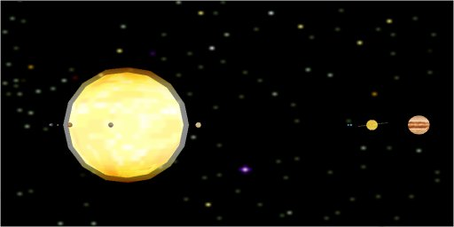



## Solar System 3D

### Description

A Direct3DRM example of Solar System in

real 3D. Need DirectX7 or higher.

For other vb games and demos visit my web site: http://web.tiscali.it/fc_vbgames/index.html
 
### More Info
 

             |
---                |---
**Submitted On**   |2002-10-24 10:57:08
**By**             |[fabio calvi](https://github.com/Planet-Source-Code/PSCIndex/blob/master/ByAuthor/fabio-calvi.md)
**Level**          |Intermediate
**User Rating**    |5.0 (10 globes from 2 users)
**Compatibility**  |VB 6\.0
**Category**       |[Miscellaneous](https://github.com/Planet-Source-Code/PSCIndex/blob/master/ByCategory/miscellaneous__1-1.md)
**World**          |[Visual Basic](https://github.com/Planet-Source-Code/PSCIndex/blob/master/ByWorld/visual-basic.md)
**Archive File**   |[Solar\_Syst14864310242002\.zip](https://github.com/Planet-Source-Code/fabio-calvi-solar-system-3d__1-40113/archive/master.zip)

